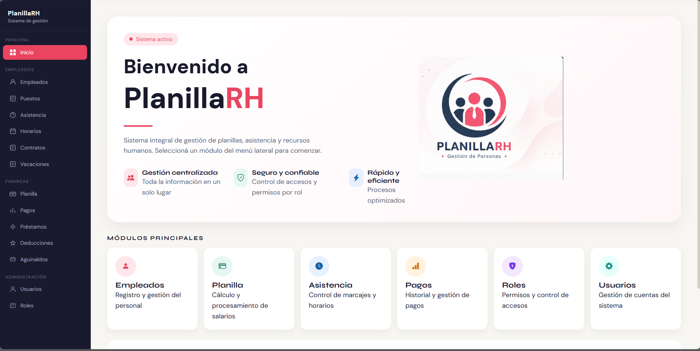
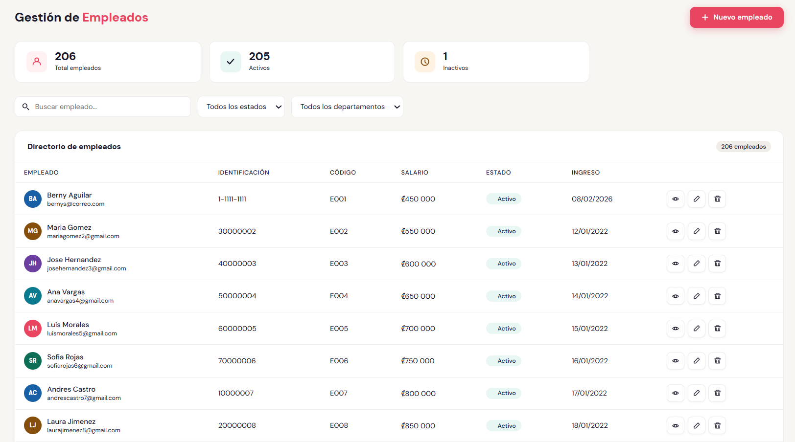
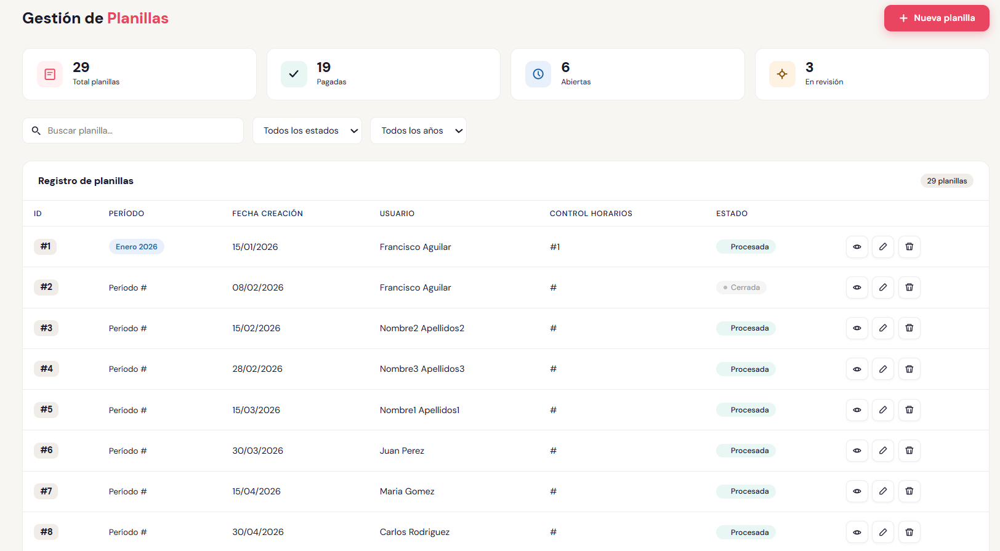
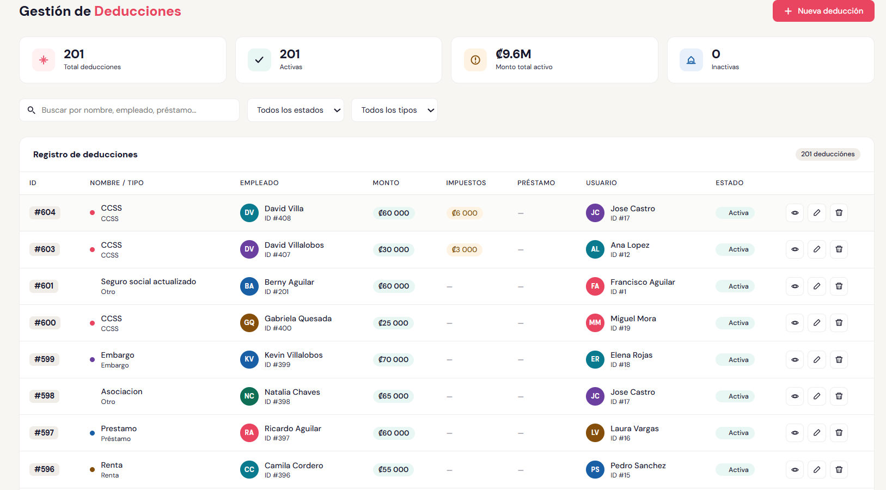

<div align="center">


# 👨🏻‍💼 PlanillaRH

### Sistema Empresarial para la Gestión Integral de Recursos Humanos

Sistema web desarrollado para optimizar la administración del talento humano mediante la gestión de empleados, planillas, asistencia, vacaciones, préstamos, deducciones, pagos y usuarios en una única plataforma.

<br>


</div>

---

#  Descripción

PlanillaRH es una plataforma web desarrollada como proyecto académico para optimizar la administración del talento humano dentro de una organización.

El sistema centraliza la gestión de empleados, puestos, contratos, asistencia, horarios, vacaciones, planillas, pagos, préstamos, deducciones, aguinaldos, usuarios y roles, proporcionando una interfaz moderna, intuitiva y responsive para facilitar los procesos administrativos.

---

#  Demostración del sistema

A continuación se muestra un recorrido por las principales funcionalidades del sistema.

VIDEO_AQU

https://github.com/user-attachments/assets/dadc5631-52d6-45cb-9663-e16cf0363bd1

---

#  Funcionalidades

-  Gestión completa de empleados.
-  Administración de puestos.
-  Control de asistencia.
-  Gestión de horarios.
-  Administración de contratos.
-  Gestión de vacaciones.
-  Gestión y procesamiento de planillas.
-  Administración de pagos.
-  Gestión de préstamos.
-  Gestión de deducciones.
-  Cálculo de aguinaldos.
-  Administración de usuarios.
-  Gestión de roles y permisos.
-  Dashboard con indicadores.
-  Búsquedas y filtros dinámicos.
-  Registro de auditoría de operaciones.
-  Diseño responsive.

---

#  Tecnologías utilizadas

| Frontend | Backend | Base de Datos | Herramientas |
|----------|----------|---------------|--------------|
| Angular | Node.js | MySQL | Visual Studio Code |
| TypeScript | Express.js | SQL | Git |
| HTML5 | JavaScript | mysql2 | GitHub |
| CSS3 | API REST | Triggers de Auditoría | npm |
| Angular Router | JWT | | Postman |
| RxJS | bcrypt | | |

---

#  Arquitectura

```text
                    Usuario
                       │
                       ▼
               Angular Frontend
                       │
                       ▼
             API REST (Express.js)
                       │
                       ▼
                  Node.js Server
                       │
                       ▼
                     MySQL
```

---

#  Vista previa del sistema

##  Dashboard Principal

<p align="center">

</p>

---

##  Gestión de Empleados

<p align="center">

</p>

---

##  Gestión de Planillas

<p align="center">

</p>

---

##  Gestión de Deducciones

<p align="center">

</p>

---

##  Gestión de Usuarios

<p align="center">

</p>

---

#  Características del sistema

- Arquitectura cliente-servidor.
- Desarrollo basado en componentes con Angular.
- API REST para la comunicación entre Frontend y Backend.
- Diseño responsive.
- Dashboard administrativo.
- CRUD completo para todos los módulos.
- Validaciones tanto en Frontend como Backend.
- Sistema de autenticación mediante JWT.
- Protección de contraseñas mediante bcrypt.
- Registro de auditoría para operaciones importantes.
- Búsquedas y filtros dinámicos.
- Interfaz moderna y amigable.

---

#  Mi participación

Participé como desarrollador **Full Stack** durante todo el desarrollo del sistema.

Entre mis principales responsabilidades se encuentran:

- Diseño y desarrollo de interfaces con Angular y TypeScript.
- Desarrollo de funcionalidades del Frontend.
- Desarrollo del Backend utilizando Node.js y Express.js.
- Implementación de APIs REST.
- Integración entre Frontend y Backend.
- Desarrollo de los módulos de Empleados, Planillas, Deducciones y Usuarios.
- Implementación de búsquedas, filtros y validaciones.
- Implementación del sistema de autenticación mediante JWT.
- Desarrollo del proceso de auditoría para el registro de operaciones.
- Optimización de consultas a la base de datos MySQL.
- Corrección de errores y mejoras del sistema.
- Participación en pruebas funcionales y validaciones.

---

# 📂 Estructura del proyecto

```text
PlanillaRH
│
├── Frontend
│   ├── src
│   ├── components
│   ├── services
│   └── assets
│
├── Backend
│   ├── routes
│   ├── controllers
│   ├── middleware
│   ├── config
│   └── server
│
├── Database
│
├── assets
│
└── README.md
```

---

#  Instalación

## Clonar el proyecto

```bash
git clone https://github.com/TU-USUARIO/PlanillaRH.git

cd PlanillaRH
```

## Frontend

```bash
cd Frontend

npm install

ng serve
```

## Backend

```bash
cd Backend

npm install

npm start
```

---

#  Estado del proyecto

🟢 **Proyecto finalizado**

Desarrollado como parte de la carrera de Ingeniería de Software.

---

#  Autores

- Berny Dávila
- Jeeyson Martínez

---

#  Licencia

Proyecto desarrollado con fines académicos.


